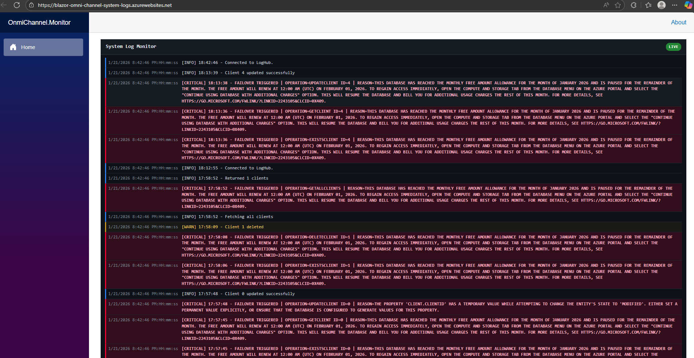

# OmniChannel.Monitor

**OmniChannel.Monitor** is a lightweight **Blazor WebAssembly** application for viewing **real-time system logs** using **SignalR**.  
It connects to a separate API that publishes logs and displays them in a clean, production-style monitoring interface.

---

## Features

- Real-time log streaming via SignalR  
- Live connection status (connected / disconnected)  
- Severity-based log coloring (INFO, WARN, ERROR, CRITICAL)  
- Automatic reconnection handling  
- Scrollable log view (no full-page scrolling)  
- Deployed as a standalone web app

---

## Screenshot

--- 

## SignalR

The application listens for log events from the SignalR hub:

ReceiveSystemLog(string message)

Logs are rendered immediately as they arrive.

---

## Log Levels

Log severity is inferred from message content:

- INFO  
- WARN  
- ERROR  
- CRITICAL  

Each level is visually highlighted to improve readability and incident detection.

---

## Tech Stack

- Blazor WebAssembly (.NET)  
- ASP.NET Core SignalR  
- Azure App Service  

---

## Notes

- This project is a client-only log monitor  
- Log publishing and storage are handled by a separate API  
- Intended for operational visibility and diagnostics  

